# Upyboard

## Upyboard 소개

### Upyboard란?

Upyboard는 MCU 보드에 구축된 Micropython 환경에서의 프로그래밍을 보조하는 개발 툴입니다. 이 툴은 다양한 기능을 제공하고 빠른 속도로 동작하여 개발자로부터 하여금 편의성을 증진시켜줄 수 있습니다.

#### 기능

제공되는 기능은 다음과 같습니다.
- **간편한 프로그램 실행** : 높은 추상화 및 간편한 환경설정들로 인해 보드 위에서의 Micropython 프로그램 실행의 간편성을 대폭 높입니다.
- **사용자 맞춤 환경설정** : 사용자 맞춤 설정을 통해 필요한 설정값을 미리 저장해 편의성을 증가시킬 수 있습니다.
- **강력한 보드 제어** : Soft Reset, Repl 접속 등 보드를 간단하고도 강력하게 제어할 수 있습니다.
- **저장소 접근 및 관리** : 보드의 저장소에 접근하고 파일들을 관리할 있어 라이브러리 업로드 등 보드의 활용도를 대폭 높일 수 있습니다.
- **자동 업데이트** : 업데이트 버전 등록 시 자동으로 감지하고 설치를 진행합니다.

#### 지원 보드

현재 지원하는 보드는 다음과 같습니다.
- [Raspberry Pi Pico 2](https://www.raspberrypi.com/products/raspberry-pi-pico-2/)
- [TiCLE](https://github.com/hanback-lab/TiCLE)
- \<향후 추가 지원 예정\>

## Upyboard 설치 방법

Upyboard 툴은 파이썬 패키지로써 Pypi에 등록되어 있어, pip로 간편하게 설치할 수 있습니다. 단, 다음 조건을 충족해야 합니다.

- Windows 11 이상
- **Python 3.10 이상**

```
pip install upyboard
```

## Quick Start

이 목차에서는 upyboard를 활용한 간단한 예시로 개발환경을 구축하고 간단한 프로그램을 실행시켜보는 실습을 진행해 보겠습니다.   

이 실습을 진행하기 위해 다음 준비 사항이 필요합니다.
- Visual Studio Code (이하 VSCode)
- Python (3.10 이상)
- upyboard 패키지
- Raspberry Pi Pico 2 or TiCLE

참고로, VSCode 및 Python 설치는 다음 링크를 참조해주시길 바랍니다.
- 통합 설치 (추천) : https://github.com/hanback-lab/TiCLE/wiki/Installation
- 개별 설치
  - VSCode : https://code.visualstudio.com/Download
  - Python : https://python.org/downloads
---

우선, VSCode 상에서 작업할 위치에 폴더를 엽니다.


<br>

장비와 PC간의 연결을 확인합니다. 그 후 터미널에 다음 명령어를 입력하여 장비에 연결된 시리얼 포트를 확인합니다.

```
upy scan
```


<br>

시리얼 포트를 확인하였다면 다음 명령어를 입력하여 현재 Workspace에 장비 Serial Port를 등록시킵니다.

```
upy -s <시리얼 포트> env
```


<br>

<details>
<summary><b>TiCLE 사용 시 추가 진행내용</b></summary>
<br>

**아래 내용은 TiCLE 보드 사용 시에만 진행하시면 됩니다.**

다음 명령어를 입력하여 장비를 초기화 및 라이브러리들을 설치합니다.

```
upy init
```


초기화가 끝났다면 다음 명령어를 통해 파일 시스템을 확인해봅니다. 초기화가 잘 끝났다면 'lib' 라는 폴더가 Pico 안에 설치되어 있습니다.

```
upy ls
```


<br>

명령어 인자값으로 폴더명을 넣어준다면 해당 폴더 내에 파일들도 확인할 수 있습니다.

```
upy ls lib
```


</details>

---

### Hello World!

다음은 micropython 프로그램을 작성하고 Pico에 업로드하는 실습입니다. 

먼저 간단한 프로그램을 작성합니다. VSCode 왼쪽 상단에 'New File' Icon을 눌러 새 파일을 생성한 다음, 'main.py' 라고 이름을 지정합니다.

   
<br>

<br><br>


파일을 아래와 같이 작성합니다.

```python
print("Hello World!")
```

<br>

다음 명령어로 프로그램 동작 결과를 확인합니다.

```
upy run main.py
```


## Commands

upyboard 명령어들의 종류 및 사용법이 담겨 있습니다. 

명령어의 기본 구조는 다음과 같습니다.

```sh
upy [OPTIONS] COMMAND [ARGS] ...
```

### scan
> 연결된 보드를 찾아 정보를 출력합니다.

연결된 보드의 연결 포트, Micropython 펌웨어 버전, 펌웨어 버전 등록 일자, 그리고 보드의 탑재된 칩 이름이 표시됩니다. 이 명령어를 통해 보드와 연결된 포트 및 정보를 손쉽게 확인할 수 있습니다.

```
upy scan
```

<details>
<summary>사용 예시</summary>

실행 결과

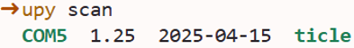
</details>

### env
> 실행 시 현재 경로를 사용자 환경으로 등록하고 구성합니다.

현재 경로에 .vscode 폴더를 생성합니다. 이 폴더는 보드와 연결된 포트 정보를 저장하며 프로그램 실행 시 포트 정보를 일일이 기입하지 않아도 자동으로 불러와 실행되게끔 설정해줍니다. 또한  VSCode의 Intellicode 및 Python extenstion에 관련 정보를 등록하여 VSCode에서도 Micropython 개발을 편리하게 할 수 있도록 구성해줍니다.

환경 등록은 해당되는 경로에 최초 1회만 실행하면 됩니다. 또한, 초기 상태에는 등록된 포트 정보가 없기에 '-s' 옵션을 사용하여 포트 정보를 명시해줍니다.

대부분의 upyboard 명령어는 사용자 환경이 upyboard 프로그램에 등록 되어 있어야 원활히 동작하며, 이는 `env` 명령어를 통해 진행할 수 있습니다. 만약 등록 되지 않은 경우 기능 사용에 제약이 되지만, `-s` 옵션을 붙여주어 일시적으로 기능을 활용할 수 있습니다.

```
upy -s <COM Port> env
```

<details>
<summary>사용 예시</summary>

실행 결과

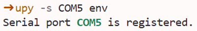
</details>

### init
> 보드를 초기화시킵니다.

보드 저장소의 저장된 파일들을 모두 삭제한 후, 라이브러리들을 설치하여 공장 초기화 상태로 만들어줍니다.

```sh
upy init
```

<details>
<summary>사용 예시</summary>

실행 결과

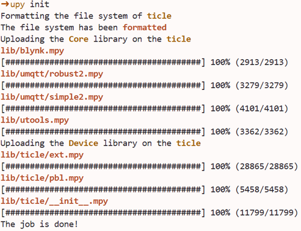
</details>

### sport

> 사용자 환경 설정에 등록된 포트 정보를 변경합니다.

같은 사용자 환경에서 보드만 달라질 경우, 연결된 포트 정보가 달라질 수 있습니다. 이에 이 명령어를 사용하여 포트 정보를 변경 후 기존과 동일하게 사용할 수 있습니다.

단, `env` 명령어로 사용자 환경이 등록된 경로에서만 동작합니다.

인자값으로 변경할 포트를 입력합니다.

```
upy sport <COM PORT>
```

<details>
<summary>사용 예시</summary>

기존 포트에서 'COM5'로 포트 변경 진행.

실행 결과

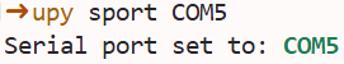
</details>

### run
> 사용자 환경에서 작성된 Micropython 프로그램을 실행시킵니다. 

이 명령어는 사용자가 작성한 Micropython 프로그램을 보드에 설치된 인터프리터를 사용하여 프로그램을 동작시킨다는 것이 가장 큰 특징입니다. 사용자 환경과 보드의 환경을 분할시켜 주어 독립적으로 동작시킴과 동시에 즉시 프로그램을 실행시키기 용이합니다.

```sh
upy run <File name>.py
```

<details>
<summary>사용 예시</summary>

'hello_world.py' 파일 생성 후 다음과 같이 입력 및 저장

```python
print("hello world!")
```

실행 결과

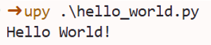
</details>

### df
> 보드 저장소의 현재 용량을 확인합니다.

```
upy df
```

<details>
<summary>사용 예시</summary>

실행 결과

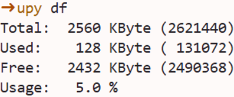

</details>

### ls

> 보드 저장소의 현재 경로에 있는 모든 폴더/파일들을 출력합니다.

인자값으로 특정 경로를 입력하면 해당 경로의 모든 폴더/파일들을 출력합니다. 입력하지 않는다면 최상위 경로 ('/') 를 출력합니다.

```sh
upy ls

# Specific path
upy ls path
```

<details>
<summary>사용 예시</summary>

실행 결과

```sh
upy ls
```

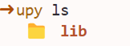

```sh 
# 보드에 탑재된 칩 종류에 따라 달라질 수 있음.
upy ls lib
```


</details>

### mkdir

> 보드 저장소 내에 폴더를 생성합니다.

특정 파일들을 정리 및 분류하는데 용이하게 사용할 수 있습니다.

인자값으로 생성할 폴더의 경로를 기입해주면 됩니다.

```sh
upy mkdir <path>
```

<details>
<summary>사용 예시</summary>
실행 결과

```sh
upy mkdir test
```

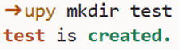

생성 확인

```sh
upy ls
```

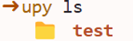
</details>

### put
> 파일을 보드 저장소에 저장시킵니다.

사용자 환경에서 작성된 Micropython 프로그램을 보드 저장소에 저장시킵니다. 단순 파일 저장을 넘어 사용자 지정 라이브러리 등록, boot 및 main 프로그램도 등록할 수 있어 보드의 활용도를 높여줄 수 있습니다.

인자값을 총 두 개까지 입력할 수 있습니다.
- 첫 번째 인자 : 저장할 파일 이름
- 두 번째 인자 (선택) : 보드에 저장할 때 붙여질 새로운 이름

```sh
# Use original file name
upy put <file name>.py

# Attach new name
upy put <file name>.py <new name>.py
```

<details>
<summary>사용 예시</summary>

사용자 환경에서 'test.py' 파일 생성 후 다음과 같이 입력 및 저장

```python
print("hello world!")
```

다음 명령어를 통해 보드에 파일 저장

```sh
upy put test.py
```

만약, 새로운 이름 (예시 : temp)로 저장할 시 다음과 같이 입력

```sh
upy put test.py temp.py
```

실행 결과

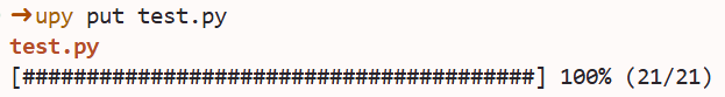
</details> 

### get
> 파일 내용을 읽고 출력합니다.

보드에 저장된 파일 내용을 읽고 터미널에 출력합니다. 보드 저장소 내에 저장된 파일의 원본이 소실되었거나 다른 작업자와 협업할 때 등 활용할 수 있습니다.

인자값으로 보드 내에서 불러올 파일 이름을 입력합니다.

```sh
upy get <file name>
```

<details>
<summary>사용 예시</summary>

사용자 환경에서 'test.py' 파일 생성 후 다음과 같이 입력 및 저장

```python
print("hello world!")
```

다음 명령어를 통해 보드 저장소에 파일 저장

```sh
upy put test.py
```

get 명령어를 통해 파일 내용 확인

```sh
upy get test.py
```

실행 결과

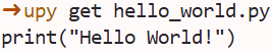
</details> 

### upload
> 파일을 컴파일하여 보드 저장소에 저장합니다.

Micropython 파일을 바이트코드 파일로 변환시켜 보드 저장소에 저장시키는 기능입니다. 경량화 및 은닉화 등의 목적으로 활용될 수 있습니다. 

인자값을 총 두 개까지 입력할 수 있습니다.
- 첫 번째 인자 : 저장할 파일 이름
- 두 번째 인자 (선택) : 보드 저장소에 저장할 때 붙여질 새로운 이름

```sh
# Use original file name
upy upload <file name>.py

# Attach new name
upy upload <file name>.py <new name>.mpy
```

<details>
<summary>사용 예시</summary>

사용자 환경에서 'test.py' 파일 생성 후 다음과 같이 입력 및 저장

```python
print("hello world!")
```

다음 명령어를 통해 보드 저장소에 컴파일된 파일 저장

```sh
upy upload test.py
```

만약, 새로운 이름 (예시 : temp)로 저장할 시 다음과 같이 입력

```sh
upy upload test.py temp.mpy
```

실행 결과

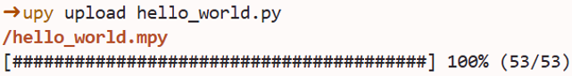
</details> 

### rm

> 보드 저장소 내의 특정 폴더 및 파일을 삭제합니다.

인자값으로 삭제할 파일 및 폴더, 혹은 경로를 입력합니다.

```sh
upy rm <path>
```

<details>
<summary>사용 예시</summary>
테스트 폴더 생성

```sh
upy mkdir test
```


생성 확인

```sh
upy ls
```


테스트 폴더 삭제

```sh
upy rm test
```


삭제 확인

```sh
upy ls
```

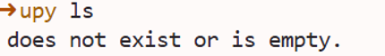
</details>

### format
> 보드 저장소을 초기화합니다.

보드 저장소에 있던 파일들을 전부 삭제합니다. 저장소를 깔끔하게 정리하고 싶을 때 유용하게 사용할 수 있습니다.

```sh
upy format
```

<details>
<summary>사용 예시</summary>

실행 결과

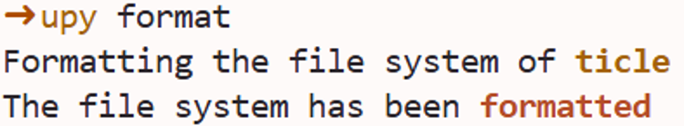

(+) format 후 파일시스템 확인

```sh
upy ls
```


</details>

### reset 

> 보드를 Soft reset 시킵니다.

해당 기능은 보드의 Micropython 인터프리터를 초기화시키는 기능입니다. 즉, RAM에 적재된 Python 코드 및 변수, 모듈 등을 초기화시킵니다.   
Reset 시 보드는 자동으로 boot.py -> main.py 프로그램을 순차적으로 실행하는데, 이 시퀀스를 이용하여 보드에 main.py 프로그램을 넣고, 보드에 전원이 공급 & 리셋을 걸어줄 시 자동으로 해당 프로그램을 실행시키게끔 하는 등의 동작을 수행시킬 수 있습니다.

```sh
upy reset
```

<details>
<summary>사용 예시</summary>

**main.py 파일 생성 및 아래 내용 기재**

```py
import machine
import time

led = machine.Pin("LED", machine.Pin.OUT)
while True:
    led.toggle()
    time.sleep_ms(1000)
```

upy reset 후 보드에 장착된 LED가 1초씩 점멸하는 지 확인

```sh
upy reset
```


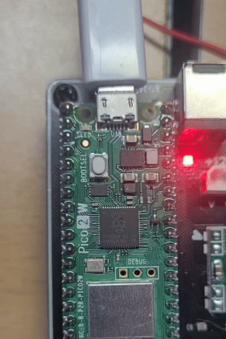

</details>

### repl

> 보드의 MicroPython REPL에 접속합니다.

REPL(Read Eval Pring Loop)이란 명령어 한 줄씩 입력받아 실행하고 그 결과를 즉시 출력해주는 대화형 인터프리터 환경입니다.

REPL은 대화형 실행 환경으로써 단순한 코드는 그 결과값을 즉시 확인해볼 수 있다는 특징을 가지고 있습니다. 이를 활용해 센서 값을 실시간으로 읽어보거나 특정 함수 및 라이브러리의 동작을 테스트해볼 수 있는 등 디버깅 및 실험에 있어서 아주 용이하게 쓰일 수 있는 기능입니다.

또한, Soft Reset 등의 단축키 기능이 담겨 있어 보드 저장소 및 전체 제어를 할 수 있습니다.

REPL에 접속하면 직전까지 실행되고 있던 프로그램은 자동으로 종료됩니다.

```sh
upy repl
```

<details>
<summary>사용 예시</summary>

repl을 열고 단순 연산값을 출력해봅니다.

```sh
upy repl
>>> print(1+2)
```

실행 결과

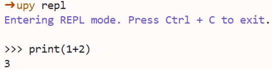

REPL에서 Soft Reset을 걸어 `reset` 과정에서 넣었던 `main.py` 프로그램을 실행시켜봅니다.

```sh
>>> <Ctrl+D>
```

실행 결과

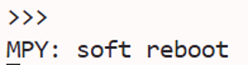

LED에 불이 점멸하는 것을 확인할 수 있습니다.

</details>

### shell

> 보드의 저장소 관리를 Shell 형태로 수행합니다.

지금까지 나왔던 저장소 관리 명령어들(ls, get, put 등) 및 자주 사용하는 명령어들을 Shell 환경에서 사용할 수 있습니다. Linux 및 Windows의 명령 프롬프트처럼 CLI 환경에서 파일을 관리하고 repl에 접속할 수 있는 등 명령어 기반 인터페이스를 사용할 수 있습니다.

```sh
upy shell
```

사용할 수 있는 명령어는 다음과 같습니다.

- clear : 화면 정리
- [ls](#ls)
- cd : 특정 경로 이동
- [get](#get)
- [put](#put)
- [rm](#rm)
- [mkdir](#mkdir)
- [df](#df)
- [repl](#repl)
- pwd : 현재 경로 출력
- help : shell 상에서 사용할 수 있는 명령어 출력